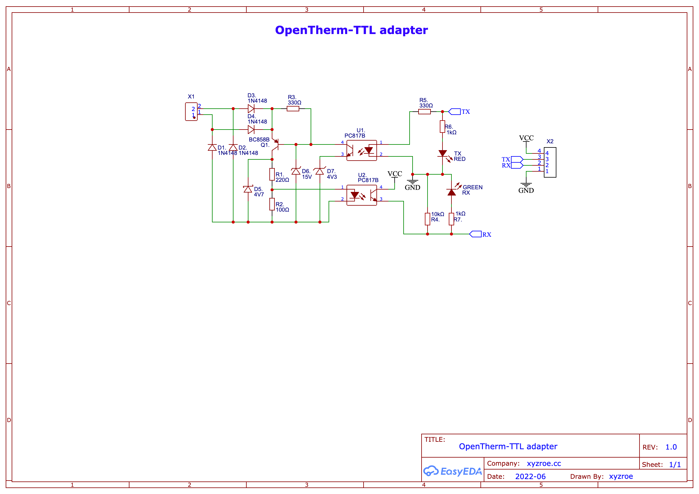

### About
This adapter is designed to connect an OpenTherm compatible boiler to any TTL port (TTL-USB, ESP8266, ESP32, Arduino, etc).  

Same size as popular RS485-TTL module for more compatibility.  

As software part you can use:
- [Tasmota OpenTherm](https://tasmota.github.io/docs/OpenTherm/) - perhaps the easiest way to connect the boiler to your smart home system 🏚
- [Opentherm IO library for Arduino](https://github.com/jpraus/arduino-opentherm) or [OpenTherm Arduino/ESP8266 Library](https://github.com/ihormelnyk/opentherm_library/) (slave mode only)  
  *if you want to build your own firmware* 🛠

### Overview

### Photos
*Photos will be uploaded after full tests*

### Schematic

### Where to buy?

### DIY
- [iBOM page](./files/iBOM.html) 🌍
- [Gerber zip](./files/Gerber_v0.2.zip) 🗂

This work is licensed under a <a rel="license" href="http://creativecommons.org/licenses/by-nc-sa/4.0/">Creative Commons Attribution-NonCommercial-ShareAlike 4.0 International License</a>

### Like ♥️?

### Inspired by
- [Schelte Bron - Opentherm Gateway](https://otgw.tclcode.com/)
- [jpraus/arduino-opentherm](https://github.com/jpraus/arduino-opentherm)  
- [Ihor Melnyk - OpenTherm Adapter](http://ihormelnyk.com/opentherm_adapter)  
- [Tasmota OpenTherm](https://tasmota.github.io/docs/OpenTherm/)
